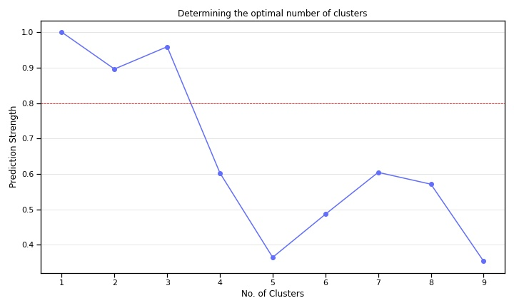
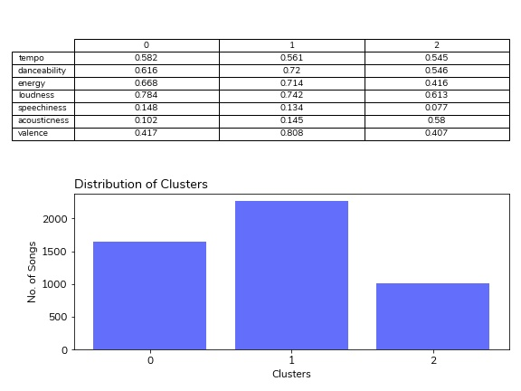
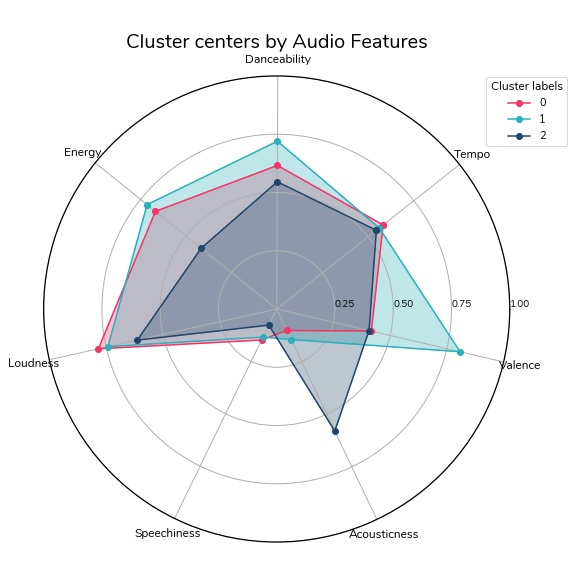
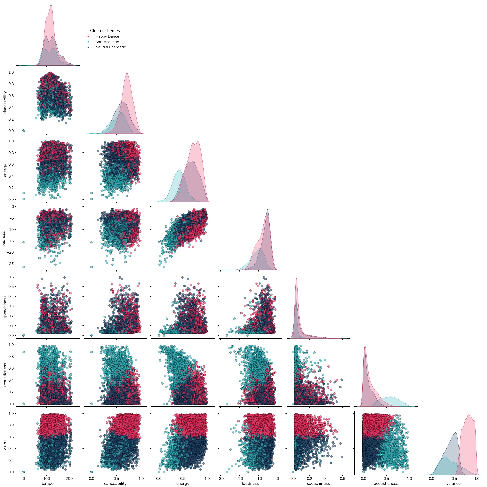
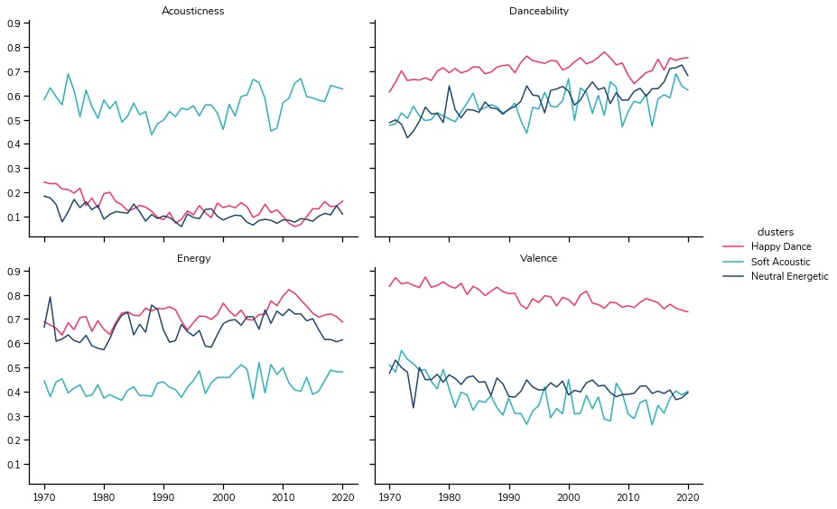
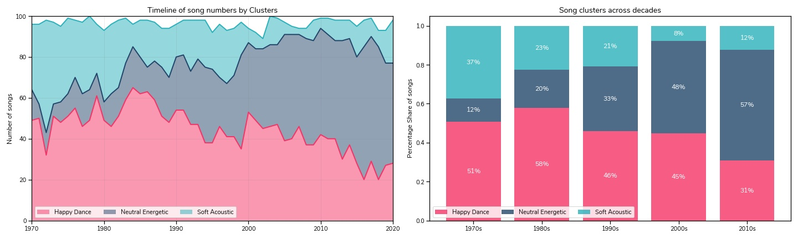

# Music Through the Ages

A Data Geek's take on the question ***'How have music tastes changed through the years?'***


<span>Photo by <a href="https://unsplash.com/@shutters_guild?utm_source=unsplash&amp;utm_medium=referral&amp;utm_content=creditCopyText">Travis Yewell</a> on <a href="https://unsplash.com/@tanulmathur/likes?utm_source=unsplash&amp;utm_medium=referral&amp;utm_content=creditCopyText">Unsplash</a></span>


*Growing up whenever I listened to Rock songs my parents commented "What is this noise? In 'our days' we listened to actual songs with beautiful melodies and soul-touching tunes, not this cacophony of monkeys with instruments"  To me this always sounded like a classic generalization, a blanket statement covering the music tastes of generations and hiding the difference in personal preference. It was hard for me to fathom that suddenly one morning people woke up and started listening to completely different songs. I believed that this was more of a difference in personal preferences and not complete generations.*

Have you ever wondered how have music tastes changed through the years? Or have they changed at all? Are the same kind of songs popular that were chartbusters 50 years ago? Or have we started to love radically different songs?  

This project is an attempt to answer these questions by collecting relevant data and analyzing it to get to the bottom of these questions.


*Billboard's Year-End Hot singles charts are based on both yearlong sales and airplay(streaming) time which makes it perfect to represent popular tastes. I'm scraping 50 years of songs, from 1970 through till 2020 from their Wikipedia pages to get the list of songs representing the most popular music 'tastes' in US. Next I'm extracting audio features for these songs from the Spotify API which will serve as the dataset for analysis.*

&nbsp;

## Workflow
Here's a look at the project workflow -


For creating the dataset I extracted most popular songs in the US since 1970 to 2020 and used the Spotify API to get their audio features. For the most popular songs I've scraped Wikipedia pages of [Billboard's Year-End Hot 100](https://en.wikipedia.org/wiki/Billboard_Year-End_Hot_100_singles_of_2020) singles charts. These charts are ideal because they are based on year-long song popularity, measured as a combination of offline sales and airplay time.

### Spotify Audio Features
Quick context around some of the Spotify Audio feature definitions most relevant to this analysis : *Complete list can be found [here](https://developer.spotify.com/documentation/web-api/reference/#endpoint-get-audio-features)*

* Acousticness - A confidence measure from 0.0 to 1.0 of whether the track is acoustic. 1.0 represents high confidence the track is acoustic.
* Danceability - Describes how suitable a track is for dancing based on a combination of musical elements including tempo, rhythm stability, beat strength, and overall regularity. A value of 0.0 is least danceable and 1.0 is most danceable.
* Energy - Energy is a measure from 0.0 to 1.0 and represents a perceptual measure of intensity and activity. Typically, energetic tracks feel fast, loud, and noisy. For example, death metal has high energy, while a Bach prelude scores low on the scale. Perceptual features contributing to this attribute include dynamic range, perceived loudness, timbre, onset rate, and general entropy.
* Valence - A measure from 0.0 to 1.0 describing the musical positiveness conveyed by a track. Tracks with high valence sound more positive (e.g. happy, cheerful, euphoric), while tracks with low valence sound more negative (e.g. sad, depressed, angry).

These features are very useful for analysis since rather than representing individual genres they represent the inherent characterstics of the songs.

Now that we have the technicalities covered, let's dive into the dataset and see what we can find. If you are interested in how the data extraction was done you can refer to *link to repo*

&nbsp;

## Data Exploration

First off let's check out Summary stats of the dataset by plotting Histograms.


This quickly gives a sneak peak into key highlights -
* Valence, Acousticess, Energy, Danceability, Loudness - these seem to have the most spread
* Most songs seem to be skewed towards the higher ranges of Danceability, Energy
* Mode and Instrumentalness hardly show any spread. They may not be very useful for our analysis here
* Surprise surprise, instrumental songs are rare among the Top 100s

Now lets standardize these features so that they can all be compared on the same scale.

Quick and dirty box plots of the *scaled* dataset to see the spread of features along the same yardstick -


Quick and dirty box plots on the standardized features makes it super clear to visualize the overall characterstics of the dataset. Few highlights appear now -

 * Dance, Energy, Loudness are definitely key themes, the distribution of songs seems to be skewed towards the higher side
 * Similarly on the other end of the spectrum highly speechy or acoustic songs are a rarity among the top 100
 * Valence - Emotional spectrum of the songs seems to be quite wide spread across happiness to sadness
 * Some features show little no variation across the dataset and are worth cutting loose - Key, Mode, Instrumentalness, Liveness, Duration

Now that we have an understanding of the overall dataset, we need to dive deeper to analyze any shifting patterns. One way can be to use the features above and analyze them over time individually. However, this would turn out to be a siloed approach focused on individual features without any focus towards interactions or common themes among the songs. Another approach can be to group similar songs and then analyze the shifts in features, hoping to unearth some underlying themes.

&nbsp;

## Clustering

This brings us to one of the most popular machine learning algorithms - K-Means clustering. Very simply, K-Means is an unsupervised learning algorithm which uses proximity (closeness) of data points to group them into similar clusters.

### Toe-Dip
Now even after having a strong intuition to perform Clustering it is important to understand if the dataset actually has the potential of showing any clusters. This can be done by calculating a 'Hopkins Score' on the scaled dataset. Essentially this checks if the dataset is derived from a uniform distribution. If the resulting score is closer to 0 it would suggest that the data is not uniformly distributed and there is merit in using clustering techniques to classify the observations, if it is closer to 0.5 this would mean the dataset is derived from a uniform distribution and there are no underlying clusters. Generally a value less than 0.2 is considered to be acceptable for clustering. [Reference link](https://pyclustertend.readthedocs.io/en/master/) for further reading.

```Python
from pyclustertend import hopkins
hopkins(norm_stats_df, norm_stats_df.shape[0])
```

For this Top 100 songs dataset the Hopkins Score came out as ***~0.176***, indicating there were clusters waiting to be uncovered!

### Elbow test
But how many? We still need to find out the ideal number of clusters before we start implementing K-Means. Firstly, lets try out the traditional 'Elbow Plot', this consists of the different number of clusters on x-axis and their respective WSSD (Within cluster Sum of Squared Distances) on the y-axis. The idea being that as the number of clusters increases the WSSD will tend to approach 0 and the 'elbow' on the line chart will indicate the point from which the reduction in SSD is very less compared to the increase in no. of clusters. Making this indicative point the most optimum number of clusters for the given dataset.


Seems like 3 clusters is the way ahead, but doesn't feel very conclusive. We can see the reduction in SSD is not worth it after 3 clusters, but what about 7?

In search of another approach to finding out optimal clusters I ended up going back to textbooks. Andy Burkiv's 100 page ML book illustrates an interesting ML approach of calculating **prediction strength** of clusters. The concept is to split the dataset into train/ test, implement clustering on both of them and then compare clusters formed in each of these to determine what %age of points are tagged to the same centroids across train and test. Recommended further reading in the [book](http://themlbook.com/).

Also discovered this [article](https://towardsdatascience.com/prediction-strength-a-simple-yet-relatively-unknown-way-to-evaluate-clustering-2e5eaf56643) online that illustrates the concept with an example.

It's well beyond the scope of this article to get much deeper into the calculations of prediction strength. Let's move on for now and see what prediction strengths look like for the current dataset.



Right after the 3 cluster point the prediction strength decreases to 60% and further down as the number of clusters is increased. Thus indicating that until 3 clusters the centroids tags are consistent across test and train groups for > 90% of the cases and as we increase clusters the tags become more inconsistent dropping the %age below 60%. This has now provided confidence that 3 clusters is the way to go!

Now let's implement K-Means using the recommended k = 3 and analyze the clusters. First looking at the overall summary stats of the clusters, so things like - location of cluster centers in the feature space, no. of songs in each cluster.  




Almost half of the songs are tagged into cluster '1', followed by '0' and '2'. The Cluster centers definitely look interesting but it's difficult to compare them on a table, let's see if we can visualize these in a different way.

&nbsp;



This Polar chart helps put the clusters into perspective, seems like -
* 0s are Neutral songs with relatively high energy/loudness     - Neutral Energetic
* 1s are Happy songs with high energy/danceability              - Happy Dance
* 2s are Soft Acoustic songs with low energy/danceability       - Soft Acoustics

Now of course this is just based on the Cluster Centers (means), lets validate if these themes hold true across the whole dataset.

&nbsp;



Interesting! the Cluster themes definitely hold together across distributions as well!
* All the charts across the Acousticness and Valence rows clearly demarcate the 'Happy Dance' & 'Soft Acoustic' clusters
* Especially Acousticness vs Valence - 'Soft Acoustic' songs are bunched on the right-side of the chart. While 'Happy Dance' on the top-left with low acousticness and high valence. Lastly 'Neutral Energetic' on the bottom left are low in both the features
* The Kernel Density plots also provide helpful insight into the 'Neutral Energetic' cluster, apart from being skewed towards the Neutral-Sad emotional zone these are relatively louder songs, similar energy but lower danceability compared to the 'Happy Dance' songs
* It's hard to differentiate the clusters in terms of Tempo and speechiness, these are consistent throughout the clusters

Overall quite happy with how the clusters have turned out. One final check to see how cluster features hold up along the years.
Since I've deliberately excluded 'year' as a feature while clustering this shouldn't be much of an issue.



These charts show the trends of respective feature means by clusters and time. (I've ignored Tempo & Speechiness from these as they are not relevant to the clusters) For example let's look at the top left chart, which draws the mean values for acousticness by clusters and years. Here we can see that the songs from 'Soft Acoustic' cluster are significantly higher than the remaining clusters and this remains the case throughout the 50 years. Similar trends can be seen across the other charts as well, individual cluster means remain distinct throughout. These trends further validate the consistency of clusters across the years.

Alright so just to recap till now we have created the dataset with 50 years of Top 100 songs along with their audio features, identified song clusters, defined their themes and validated them against the overall dataset and throughout time. Next it's time to answer the big question.

&nbsp;

## How have music trends shifted in the last 50 years?



Voila! Music trends have certainly shifted over time!
* 'Neutral Energetic' songs have increasingly become more and more popular. Starting of from just 12% songs in the Top 100s in the 1970s this category has come up to become the most popular one in the 2010s with majority share of songs of 57%
* 'Soft Acoustic' songs have lost the most popularity. Fan favorites during the 1970s with 37% share, they have now dropped to only 12% in the 2010s
* 'Happy Dance' songs certainly seems to be a timelessly popular category till 2000s, but even their share has dropped to only 31% in the 2010s

One underlying theme running across clusters and time is that we love energetic dance songs. The emotional gradient of songs may have shifted to a more neutral tone from the Happy notes of the yester years but throughout the 50 years we have always loved a nice groove!  

&nbsp;

## Conclusion
Well this finally brings us to the end of the project for now. Here I've used Web scraping, Audio features from the Spotify API and the k-means clustering algorithm to show that music tastes have indeed shifted in the past 50 years. While there isn't a radical shift in the popularity of danceable & energetic songs, the emotional gradient has certainly shifted from 'Happy' to more 'Neutral' notes. Hopefully this project shows how we can use/create the right data, open source libraries and machine learning to answer any seemingly abstract question.


## Next Steps
There are few more interesting areas where I feel this project can be expanded -
1. Including songs further back from the start of 1945
2. Adding other dimensions of audio data like - genre, lyrics, instruments used, etc.
3. It will be great to get sales information around individual albums to give depth into popularity beyond Billboard chart ranks
4. A Web app that lets you create Spotify playlist of any year's Top 100 songs


Feel like playing around the dataset? Wonder which artist has the most Hits? Spoiler alert it's not Pink Floyd! Is The Weeknd on there? wait what-about The Beatles?? You can head over to the Streamlit web app!
